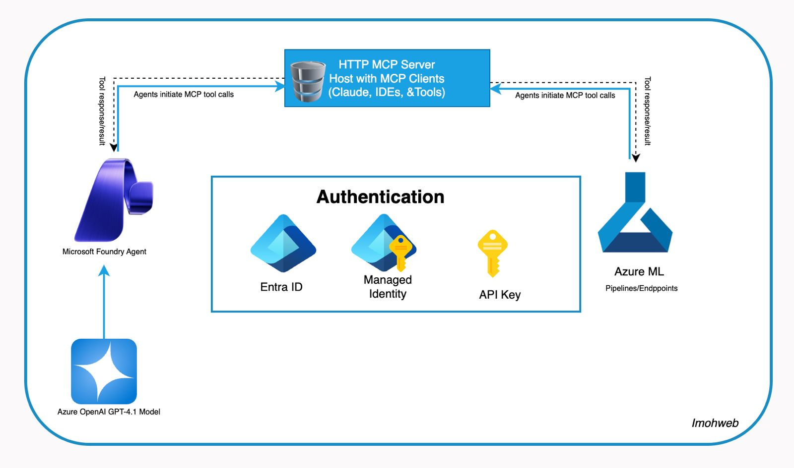

# MCP Foundry ML Integration

> **Bridging Microsoft Foundry Agents, Model Context Protocol (MCP), and Azure Machine Learning**

A production-ready implementation demonstrating how AI agents can safely trigger enterprise machine learning workflows through standardized tool-calling mechanisms.

## 🎯 Project Objective

Enable Microsoft Foundry Agents to interact with Azure Machine Learning through a secure MCP (Model Context Protocol) server, creating a **3-layer intelligent automation stack** for enterprise ML operations.

## 🏗️ Architecture

This project implements a **3-layer intelligent automation stack**:

### Architecture Diagram



### Layer 1 — Intelligence (Foundry Agent)
- Understands user intent
- Chooses the correct tool
- Processes tool outputs
- Responds naturally in conversation

### Layer 2 — Integration (MCP Server)
- The "middleware conductor"
- Exposes Python functions as safe MCP tools
- Routes calls from agents to enterprise systems
- Enforces tool boundaries and validation

### Layer 3 — Execution (Azure ML)
- Handles real workloads (pipelines, jobs, training, experiments)
- Provides compute resources and scaling
- Ensures governance and tracking

### Architecture Flow

```
┌─────────────────────────────────────────────────────────────────┐
│                                                                 │
│   Foundry Agent (Layer 1)                                      │
│   ├─ Interprets user requests                                  │
│   ├─ Calls MCP tools                                           │
│   └─ Processes responses                                       │
│                          │                                      │
│                          ▼                                      │
│   MCP Server (Layer 2)                                         │
│   ├─ greet(name)                                               │
│   ├─ add_numbers(a, b)                                         │
│   ├─ run_aml_pipeline(payload)                                 │
│   ├─ list_aml_experiments()                                    │
│   └─ get_aml_job_status(job_name)                             │
│                          │                                      │
│                          ▼                                      │
│   Azure ML (Layer 3)                                           │
│   ├─ Executes pipelines                                        │
│   ├─ Manages experiments                                       │
│   ├─ Tracks jobs                                               │
│   └─ Provides compute resources                                │
│                                                                 │
└─────────────────────────────────────────────────────────────────┘
```

## 📦 Project Structure

```
mcp-foundry-ml/
├── server.py                      # MCP Server entry point (FastAPI)
├── mcp_foundry_agent.py          # Foundry Agent entry point (Interactive demo)
├── requirements.txt              # Python dependencies
├── test-mcp-tools.http           # REST Client tests for all MCP tools
├── .env                          # Environment variables (credentials) - NOT in git
├── .env.example                  # Template for .env file
├── README.md                     # This file
│
├── aml/                          # Azure ML definitions
│   ├── jobs/
│   │   └── pipeline.yml          # Demo pipeline definition
│   └── models/                   # (Reserved for model registrations)
│
├── src/
│   ├── mcp_server/               # Layer 2: MCP Server
│   │   ├── __init__.py
│   │   ├── main.py               # FastAPI server with tool routing
│   │   ├── config.py             # Server configuration
│   │   └── tools/                # MCP tools
│   │       ├── __init__.py
│   │       ├── utility_tools.py  # Demo tools (greet, add_numbers)
│   │       └── azure_ml_tools.py # Azure ML tools (run_aml_pipeline, etc.)
│   │
│   └── foundry_agent/            # Layer 1: Foundry Agent
│       ├── __init__.py
│       ├── client.py             # Interactive agent demo with tool calling
│       └── bridge.py             # Azure ML operations bridge
│
├── scripts/
│   ├── setup.sh                  # Automated project setup
│   └── create-compute.sh         # Create Azure ML compute cluster
│
└── docs/
    ├── IMPLEMENTATION_GUIDE.md   # Detailed implementation walkthrough
    ├── PRESENTATION_GUIDE.md     # Quick reference for tech talk
    ├── CHECKLIST.md              # Project completion checklist
    └── diagrams/                 # Architecture diagrams
```

## 🚀 Quick Start

### Prerequisites

- **Python 3.9+** (tested with Python 3.13)
- **Azure subscription** with:
  - Azure AI Foundry project
  - Azure Machine Learning workspace
  - Compute cluster (created automatically by setup script)
- **Azure CLI** installed and authenticated

### 1. Clone and Setup

```bash
# Navigate to project directory
cd mcp-foundry-ml

# Run automated setup script
chmod +x scripts/setup.sh
./scripts/setup.sh
```

The setup script will:
- ✅ Check Python version
- ✅ Create virtual environment
- ✅ Install dependencies
- ✅ Verify Azure CLI authentication
- ✅ Create `.env` file template
- ✅ Guide you through configuration

### 2. Configure Environment

Copy `.env.example` to `.env` and fill in your Azure credentials:

```bash
cp .env.example .env
# Edit .env with your actual values
```

**Required environment variables:**

```bash
# Azure ML Configuration
AZURE_SUBSCRIPTION_ID=your-subscription-id
AZURE_RESOURCE_GROUP=your-resource-group
AZURE_ML_WORKSPACE=your-workspace-name

# Microsoft Foundry Agent Configuration
PROJECT_ENDPOINT=https://your-foundry-resource.services.ai.azure.com/projects/your-project
MODEL_DEPLOYMENT_NAME=your-model-deployment
AGENT_ID=your-agent-id
AGENT_NAME=your-agent-name

# API Key (if using key-based authentication)
AZURE_AI_PROJECT_API_KEY=your-api-key

# MCP Server Configuration
MCP_SERVER_URL=http://localhost:8000/mcp/call
MCP_SERVER_NAME=MCP Foundry Bridge Server
MCP_SERVER_HOST=0.0.0.0
MCP_SERVER_PORT=8000
```

### 3. Create Azure ML Compute Cluster

```bash
# Automated script creates compute cluster for you
chmod +x scripts/create-compute.sh
./scripts/create-compute.sh
```

This creates a `mcp-compute` cluster (Standard_DS3_v2, auto-scaling 0-2 instances).

### 4. Run the MCP Server

**Terminal 1 - Start MCP Server:**
```bash
python3 server.py
```

You'll see:
```
INFO:     Uvicorn running on http://127.0.0.1:8000
INFO:     Application startup complete.
```

### 5. Run the Foundry Agent Demo (Interactive)

**Terminal 2 - Start Agent Demo:**
```bash
python3 mcp_foundry_agent.py
```

You'll be prompted to enter your message:
```
💬 Enter your message for the agent (or press Enter for default):
   Default: 'Hi, use the MCP server to run my ML pipeline'
Your message: _
```

**Example prompts:**
- `"Run my ML pipeline"` → Submits pipeline to Azure ML
- `"List all experiments"` → Shows all ML experiments
- `"Check job status"` → Gets status of a specific job
- `"Hello there"` → Calls greet tool

The agent will:
1. ✅ Connect to Azure AI Foundry
2. ✅ Understand your request
3. ✅ Call appropriate MCP tool
4. ✅ Display results

### 6. Test MCP Tools Directly (Optional)

Use the included REST Client test file:

```bash
# Open test-mcp-tools.http in VS Code
# Click "Send Request" above each test
```

Or use curl:
```bash
curl -X POST http://localhost:8000/mcp/call \
  -H "Content-Type: application/json" \
  -d '{"tool_name": "greet", "parameters": {"name": "Azure Community"}}'
```

### 7. Expose MCP Server Publicly (Optional - for Agent Playground)

To use Azure AI Foundry Agent Playground with your local MCP server:

```bash
# Install ngrok
brew install --cask ngrok

# Authenticate (get token from https://dashboard.ngrok.com)
ngrok config add-authtoken YOUR_TOKEN

# Terminal 3 - Expose local server
ngrok http 8000
```

You'll get a public URL like: `https://your-subdomain.ngrok-free.app`

Use this URL in Azure AI Foundry Agent Playground:
```
https://your-subdomain.ngrok-free.app/mcp/call
```

## 🛠️ Available MCP Tools

The MCP server exposes the following tools that Foundry Agents can call:

### Core Azure ML Tools (Enterprise Integration)

These are the production tools for real ML operations:

#### `run_aml_pipeline(pipeline_job_yaml, payload, experiment_name)`
Triggers an Azure ML pipeline job.

**Parameters:**
- `pipeline_job_yaml` (str): Path to pipeline YAML (default: "aml/jobs/pipeline.yml")
- `payload` (dict): Data to pass to the pipeline
- `experiment_name` (str): Experiment name (default: "mcp-integration-demo")

**Example:**
```python
run_aml_pipeline(
    pipeline_job_yaml="aml/jobs/pipeline.yml",
    payload={"message": "Process this data", "batch_size": 100},
    experiment_name="my-ml-experiment"
)
```

#### `list_aml_experiments()`
Lists all experiments in the Azure ML workspace.

**Example:**
```python
list_aml_experiments()
# Returns: {"status": "success", "experiments": [...], "count": 5}
```

#### `get_aml_job_status(job_name: str)`
Gets the status and details of a specific Azure ML job.

**Example:**
```python
get_aml_job_status("elastic_mountain_xyz123")
# Returns: {"status": "Running", "job_name": "elastic_mountain_xyz123", ...}
```

### Demo/Testing Tools

These tools demonstrate the MCP workflow and are useful for testing:

#### `greet(name: str)`
Simple greeting function for validating MCP tool calling.

**Example:**
```python
greet("Alice")
# Returns: "Hello, Alice! Welcome to the MCP Foundry ML integration."
```

#### `add_numbers(a: float, b: float)`
Adds two numbers - useful for testing tool parameter passing.

**Example:**
```python
add_numbers(5, 3)
# Returns: {"sum": 8, "inputs": {"a": 5, "b": 3}, "operation": "5 + 3 = 8"}
```

## 📝 Usage Examples

### Example 1: Testing the MCP Server

Test with demo tools to validate the integration:

```bash
# Test via browser
http://localhost:8000/

# Test via API
curl -X POST http://localhost:8000/mcp/call \
  -H "Content-Type: application/json" \
  -d '{"tool_name": "greet", "parameters": {"name": "Azure Community"}}'
```

### Example 2: Trigger ML Pipeline via Agent

Agent understands natural language and triggers ML operations:

Ask the agent to run an ML pipeline:

```
User: "Run the ML pipeline with my training data"

Agent: [calls run_aml_pipeline tool]
Agent: "I've submitted the pipeline job. Job ID: elastic_mountain_xyz123. Status: Running."
```

### Example 3: Check Job Status

```
User: "What's the status of job elastic_mountain_xyz123?"

Agent: [calls get_aml_job_status tool]
Agent: "The job is currently running. It started 5 minutes ago."
```

## 🔐 Authentication

This project supports multiple Azure authentication methods:

1. **Azure CLI** (Recommended for local development)
   ```bash
   az login
   ```

2. **Managed Identity** (For production deployments)
   - System-assigned identity
   - User-assigned identity

3. **Environment Variables**
   ```bash
   export AZURE_CLIENT_ID=<client-id>
   export AZURE_TENANT_ID=<tenant-id>
   export AZURE_CLIENT_SECRET=<client-secret>
   ```

The `DefaultAzureCredential` from `azure-identity` automatically tries these methods in order.

## 🧪 Development

### Adding New MCP Tools

1. Create the tool function in `src/mcp_server/tools/`:
   ```python
   def my_new_tool(param1: str, param2: int) -> dict:
       """Tool description."""
       # Implementation
       return {"result": "..."}
   ```

2. Register it in `src/mcp_server/main.py`:
   ```python
   @mcp.tool()
   def my_new_tool(param1: str, param2: int) -> dict:
       """Tool description for the agent."""
       return tools.my_new_tool(param1, param2)
   ```

3. Add it to the allowed tools list in `src/foundry_agent/client.py`:
   ```python
   for tool_name in ("greet", "add_numbers", "run_aml_pipeline", "my_new_tool"):
       mcp_tool.allow_tool(tool_name)
   ```

### Testing

Test individual components:

```bash
# Test MCP tools directly
python -c "from src.mcp_server.tools import utility_tools; print(utility_tools.greet('Test'))"

# Test Azure ML bridge
python -c "from src.foundry_agent.bridge import McpAzureMlBridge; bridge = McpAzureMlBridge.from_env(); print(bridge.list_experiments())"
```

## 📚 Key Concepts

### What is MCP (Model Context Protocol)?

MCP is a protocol that creates a stable interface between LLMs and enterprise systems. It makes AI-driven automation:
- **Predictable**: Standardized tool definitions and responses
- **Controlled**: Validation and approval mechanisms
- **Secure**: Proper authentication and authorization

### Why This Architecture?

**Problem**: AI agents (like GPT-4) can't directly call enterprise systems safely.

**Solution**: 
1. **Foundry Agents** provide natural language understanding
2. **MCP Server** acts as a secure gateway with validated tools
3. **Azure ML** handles the actual compute workloads

This separation ensures:
- Security boundaries
- Proper error handling
- Auditability
- Scalability

## 🤝 Contributing

Contributions are welcome! Areas for enhancement:
- Additional Azure ML operations (model deployment, endpoint management)
- Enhanced error handling and retry logic
- Monitoring and logging improvements
- Integration tests
- Documentation improvements

## 📄 License

This project is provided as-is for educational and demonstration purposes.

## 📖 Documentation

- **[Implementation Guide](docs/IMPLEMENTATION_GUIDE.md)** - Detailed step-by-step walkthrough of how this was built
- **[Architecture Diagram](docs/diagrams/mcp-foundry-azureml-integration.jpeg)** - Visual representation of the system

## 🎤 Presentation

This project was presented at the **Azure NG Community Tech Call - November 2025**

**Key Talking Points:**
1. The problem: AI agents can't safely call enterprise systems directly
2. The solution: MCP as a secure middleware layer
3. The implementation: 3-layer architecture (Intelligence, Integration, Execution)
4. The benefits: Security, governance, standardization, scalability

## 🔗 Resources

- [Model Context Protocol (MCP)](https://modelcontextprotocol.io/)
- [Azure AI Foundry](https://azure.microsoft.com/en-us/products/ai-services/ai-foundry/)
- [Azure Machine Learning](https://azure.microsoft.com/en-us/products/machine-learning/)
- [Microsoft Foundry Agents SDK](https://learn.microsoft.com/en-us/azure/ai-services/agents/)
- [FastAPI Documentation](https://fastapi.tiangolo.com/)

## 🆘 Troubleshooting

### Common Issues

**Issue**: `ModuleNotFoundError: No module named 'mcp_server'`
- **Solution**: Ensure you're running from the project root and `src/` is in `sys.path`

**Issue**: `KeyError: 'AZURE_SUBSCRIPTION_ID'`
- **Solution**: Configure your `.env` file or set environment variables

**Issue**: `Authentication failed`
- **Solution**: Run `az login` and ensure you have access to the resources

**Issue**: Pipeline job fails with "compute not found"
- **Solution**: Update `aml/jobs/pipeline.yml` with your actual compute cluster name

---

## 📁 Key Files Explained

| File/Folder | Purpose |
|-------------|---------|
| **server.py** | MCP Server entry point - Starts FastAPI server on port 8000 |
| **mcp_foundry_agent.py** | Interactive agent demo - Prompts for user input and demonstrates full workflow |
| **test-mcp-tools.http** | REST Client tests - Quick testing of all 5 MCP tools |
| **.env** | **Your credentials** - Never commit this! (Already in .gitignore) |
| **.env.example** | Template for .env - Safe to commit, no secrets |
| **aml/jobs/pipeline.yml** | Azure ML pipeline definition - Simple demo pipeline |
| **aml/models/** | Reserved for model registrations (currently unused, for future expansion) |
| **src/mcp_server/main.py** | FastAPI server with tool routing logic |
| **src/mcp_server/tools/** | Tool implementations (utility_tools.py, azure_ml_tools.py) |
| **src/foundry_agent/client.py** | Agent demo with interactive prompts and keyword-based tool selection |
| **src/foundry_agent/bridge.py** | Azure ML operations (submit pipeline, list experiments, get job status) |
| **scripts/setup.sh** | Automated setup - Checks prereqs, creates venv, installs deps, guides config |
| **scripts/create-compute.sh** | Creates Azure ML compute cluster (mcp-compute) |
| **docs/IMPLEMENTATION_GUIDE.md** | Detailed step-by-step implementation walkthrough |
| **docs/PRESENTATION_GUIDE.md** | Quick reference for tech talk presentation |

## 🔒 Security Notes

✅ **All credentials are stored in `.env` file only**
✅ **`.env` is in `.gitignore` - never committed to git**
✅ **No hardcoded secrets in any source code**
✅ **`.env.example` is safe to share - contains only placeholders**

Always use `.env.example` as a template when sharing this project.

---

**Built with ❤️ for the Azure NG Community Tech Talk - November 2025**
